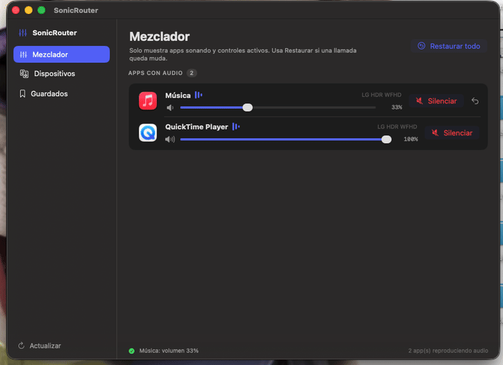
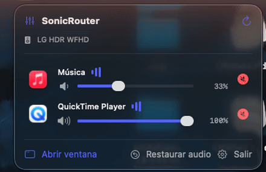

# SonicRouter

App local para macOS para ver qué apps están reproduciendo audio y **silenciar las que quieras** sin afectar al resto. Inspirada en Background Music, SoundSource y eqMac.

Caso de uso típico: estás en una llamada de FaceTime y quieres ver un video → silencias la llamada con un clic y sigues escuchando el video.

### Mezclador por app (ventana completa)

Sube, baja o silencia cada app de forma independiente:



### Control rápido desde la barra de menús

Al cerrar la ventana, la app sigue viva en la barra de menús (arriba a la derecha) y puedes seguir controlando el audio sin abrirla:



## Qué hace

- **Mute real por app** usando *Process Taps* de Core Audio (`AudioHardwareCreateProcessTap`). El audio de la app se silencia a nivel de sistema sin cerrar ni pausar la app.
- **Volumen por app**: sube o baja cada app de forma independiente (mezclador real), no solo silenciar.
- Detecta y agrupa las apps que están reproduciendo audio (junta los procesos helper de Chrome, FaceTime, etc. en una sola fila).
- **Barra de menú** con un panel rápido para silenciar/activar sin abrir la ventana, **+ ventana completa** con el mezclador, los dispositivos y los niveles guardados.
- **Modo barra de menús**: al cerrar la ventana, la app desaparece del Dock pero sigue funcionando desde el icono de la barra de menús (arriba a la derecha). "Abrir ventana" desde ese panel restaura el Dock; "Salir" cierra del todo.
- **Restaurar todo**: botón de emergencia que quita todos los taps y devuelve el audio a la normalidad (también se ejecuta al cerrar la app).
- Gestión de dispositivos CoreAudio: cambiar salida/entrada predeterminada y su volumen.

## Permiso necesario

Los Process Taps requieren el permiso de **captura de audio del sistema** (TCC). La primera vez que silencias algo, macOS pedirá autorización. El `Info.plist` incluye `NSAudioCaptureUsageDescription`.

> Importante: este permiso solo funciona ejecutando la app como `.app` (no con `swift run`). Si silenciar no hace nada, abre **Ajustes → Privacidad y seguridad → Grabación de audio / Micrófono**, activa SonicRouter y pulsa **Reintentar** en el banner.

## Volumen por app

macOS **no tiene una API pública de volumen por aplicación**, así que SonicRouter lo hace como SoundSource: captura el audio de la app con un process tap, silencia su salida original y la **re-emite al volumen elegido** mediante un dispositivo agregado privado. Todo ocurre en un solo IOProc dentro del mismo dominio de reloj (la salida real), así que solo añade un par de milisegundos de latencia a esa app.

- **Mute** (`MuteEngine`): el IOProc descarta el audio y emite silencio. Inmediato, sin latencia.
- **Volumen** (`AppVolumeTap`): el mismo montaje, pero el IOProc copia el audio multiplicado por la ganancia.

Ambos arrancan solo cuando controlas una app. Una vez que el motor de volumen está activo, **se queda activo incluso al 100%** para que el deslizador no salte entre la ruta nativa y la re-emisión (el clásico bajón al pasar de 100 a 99); solo «Restablecer», el mute o que la app deje de existir lo apagan. El deslizador usa una **curva perceptual** (ganancia = posición²), así 50% suena aproximadamente a la mitad. La diferencia de nivel entre la ruta nativa y la re-emisión se calibra una vez en Ajustes (compensación 0.5×–8×).

## Ejecutar

Para que el mute funcione hay que correr la `.app` (por el permiso de captura):

```bash
chmod +x Scripts/build-app.sh
Scripts/build-app.sh
open build/SonicRouter.app
```

El icono de la app (`Assets/AppIcon.icns`) se genera con `swift Scripts/make-icon.swift` y el script de build lo incluye en el bundle automáticamente.

Para desarrollo de UI sin audio real, `swift run` sigue funcionando (pero el mute no tendrá permiso).

## Requisitos

- macOS 15 o superior.
- Swift toolchain instalada.

## Privacidad

SonicRouter procesa el audio **solo en memoria y solo en tu Mac**: no graba, no guarda y
no transmite nada. Lo único que se persiste son tus preferencias (volúmenes y rutas por
app). Los detalles del modelo de seguridad están en [SECURITY.md](SECURITY.md).

## Licencia

[MIT](LICENSE) © 2026 Francesco Catania.
