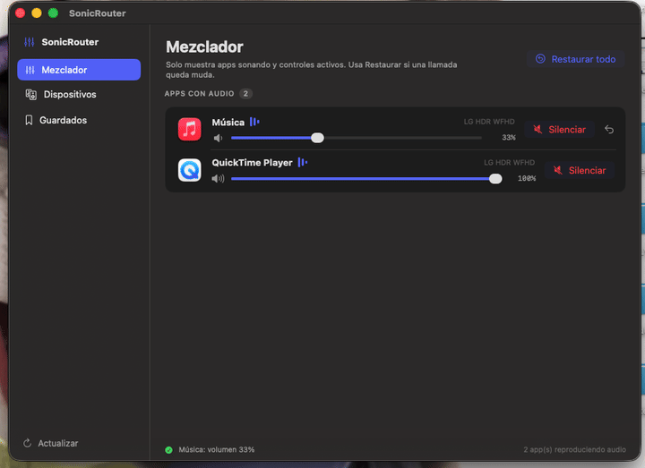
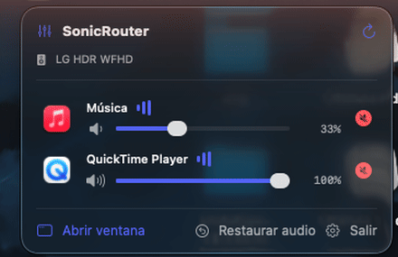

# SonicRouter

App local para macOS para ver qué apps están reproduciendo audio y **silenciar las que quieras** sin afectar al resto. Inspirada en Background Music, SoundSource y eqMac.

Caso de uso típico: estás en una llamada de FaceTime y quieres ver un video → silencias la llamada con un clic y sigues escuchando el video.

### Mezclador por app (ventana completa)

Sube, baja o silencia cada app de forma independiente:



### Control rápido desde la barra de menús

Al cerrar la ventana, la app sigue viva en la barra de menús (arriba a la derecha) y puedes seguir controlando el audio sin abrirla:



## Qué hace

- **Mute real por app** usando *Process Taps* de Core Audio (`AudioHardwareCreateProcessTap`). El audio de la app se silencia a nivel de sistema sin cerrar ni pausar la app.
- **Volumen por app**: sube o baja cada app de forma independiente (mezclador real), no solo silenciar.
- **Routing por app**: envía cada aplicación a una salida concreta y restaura esa ruta cuando vuelve a reproducir audio.
- **Perfiles persistentes** por bundle id (o por nombre cuando no existe): conservan volumen y salida entre ejecuciones.
- Detecta y agrupa las apps que están reproduciendo audio (junta los procesos helper de Chrome, FaceTime, etc. en una sola fila).
- **Barra de menú** con un panel rápido para silenciar/activar sin abrir la ventana, **+ ventana completa** con el mezclador, los dispositivos y los niveles guardados.
- **Modo barra de menús**: al cerrar la ventana, la app desaparece del Dock pero sigue funcionando desde el icono de la barra de menús (arriba a la derecha). "Abrir ventana" desde ese panel restaura el Dock; "Salir" cierra del todo.
- **Restaurar todo**: botón de emergencia que quita todos los taps y devuelve el audio a la normalidad (también se ejecuta al cerrar la app).
- **Consumo mínimo en segundo plano**: no hay bucle de sondeo. SonicRouter reacciona a eventos de Core Audio y del sistema, y cuando no hay ventana abierta ni nada controlado entra en modo **«En reposo»** soltando todas las escuchas. El modo de energía actual (Activo / En reposo / Suspendido) se ve en vivo en la barra de estado, el panel de la barra de menús y Ajustes.
- Gestión de dispositivos CoreAudio: cambiar salida/entrada predeterminada y su volumen.

## Permiso necesario

Los Process Taps requieren el permiso de **captura de audio del sistema** (TCC). La primera vez que silencias algo, macOS pedirá autorización. El `Info.plist` incluye `NSAudioCaptureUsageDescription`.

> Importante: este permiso solo funciona ejecutando la app como `.app` (no con `swift run`). Si silenciar no hace nada, abre **Ajustes → Privacidad y seguridad → Grabación de audio / Micrófono**, activa SonicRouter y pulsa **Reintentar** en el banner.

## Volumen por app

macOS **no tiene una API pública de volumen por aplicación**, así que SonicRouter lo hace como SoundSource: captura el audio de la app con un process tap, silencia su salida original y la **re-emite al volumen elegido** mediante un dispositivo agregado privado. Todo ocurre en un solo IOProc dentro del mismo dominio de reloj (la salida real), así que solo añade un par de milisegundos de latencia a esa app.

- **Mute** (`MuteEngine`): el IOProc descarta el audio y emite silencio. Inmediato, sin latencia.
- **Volumen** (`AppVolumeTap`): el mismo montaje, pero el IOProc copia el audio multiplicado por la ganancia.

Al volver al 100% en la salida predeterminada, SonicRouter desmonta el tap y restaura de inmediato la ruta nativa de la app. Entre 1% y 99% usa una ruta de captura y re-emisión con ganancia **lineal**. La compensación recupera parte del nivel perdido usando solo el margen disponible en cada bloque; un limitador reduce la ganancia antes de que un pico pueda recortarse. Una salida elegida explícitamente mantiene el motor incluso al 100% porque sigue necesitando reenrutar el audio.

### Versiones experimentales anteriores

La app actual no instala ningún driver. Si todavía aparece **SonicRouter Audio** en Configuración de Audio MIDI, procede de una versión experimental que instaló `/Library/Audio/Plug-Ins/HAL/SonicRouterAudio.driver`. La versión actual oculta e ignora ese dispositivo para que no pueda seleccionarse accidentalmente. Su eliminación es una operación administrativa independiente y no se realiza automáticamente durante una actualización.

## Energía y segundo plano

Un tap de volumen/mute es un dispositivo agregado con un IOProc que tira de audio de forma continua, así que mantenerlo vivo cuesta batería. SonicRouter lo minimiza:

- **Sin sondeo**: en vez de un temporizador en bucle, escucha eventos de Core Audio (lista de procesos, `IsRunningOutput` por proceso) y de lanzamiento/cierre de apps. Sin ventana abierta ni nada controlado, no hay escuchas activas (modo **En reposo**).
- **Reposo del sistema**: al dormir el Mac (tapa cerrada) libera **todos** los motores de audio para no mantener despierto el hardware, y los **restaura al despertar** exactamente como estaban. Es el arreglo del consumo «con el portátil cerrado».

## Ejecutar

### Descarga directa (sin compilar)

Descarga la app ya compilada desde la [última release](https://github.com/SekaiBuilder/sonicrouter/releases/latest), descomprime el archivo para macOS y arrastra `SonicRouter.app` a Aplicaciones. La primera vez ábrela con **clic derecho → Abrir** si la release no está firmada con una cuenta de desarrollador.

### Instalación en un comando

Instala la toolchain de Swift (Command Line Tools, si aún no la tienes), descarga SonicRouter, lo compila y lo abre:

```bash
xcode-select -p >/dev/null 2>&1 || xcode-select --install; git clone https://github.com/SekaiBuilder/sonicrouter.git && cd sonicrouter && chmod +x Scripts/build-app.sh && Scripts/build-app.sh && open build/SonicRouter.app
```

> Si era la primera vez que se instalaban los Command Line Tools, espera a que termine la instalación y vuelve a ejecutar el comando.

### Paso a paso

Para que el mute funcione hay que correr la `.app` (por el permiso de captura):

```bash
chmod +x Scripts/build-app.sh
Scripts/build-app.sh
open build/SonicRouter.app
```

El icono de la app (`Assets/AppIcon.icns`) se genera con `swift Scripts/make-icon.swift` y el script de build lo incluye en el bundle automáticamente.

El build es universal (Apple silicon + Intel) de forma predeterminada. Para una compilación local rápida de una sola arquitectura usa `SONICROUTER_UNIVERSAL=0 Scripts/build-app.sh`.

Para desarrollo de UI sin audio real, `swift run` sigue funcionando (pero el mute no tendrá permiso).

Las reglas puras de perfiles y control de audio se verifican con:

```bash
Scripts/test.sh
swift build -Xswiftc -warnings-as-errors
```

## Requisitos

- macOS 15 o superior.
- Swift toolchain instalada.
- Mac con Apple silicon o Intel de 64 bits.

## Privacidad

SonicRouter procesa el audio **solo en memoria y solo en tu Mac**: no graba, no guarda y
no transmite nada. Lo único que se persiste son tus preferencias (volúmenes y rutas por
app). Los detalles del modelo de seguridad están en [SECURITY.md](SECURITY.md).

## Licencia

[MIT](LICENSE) © 2026 Francesco Catania.
